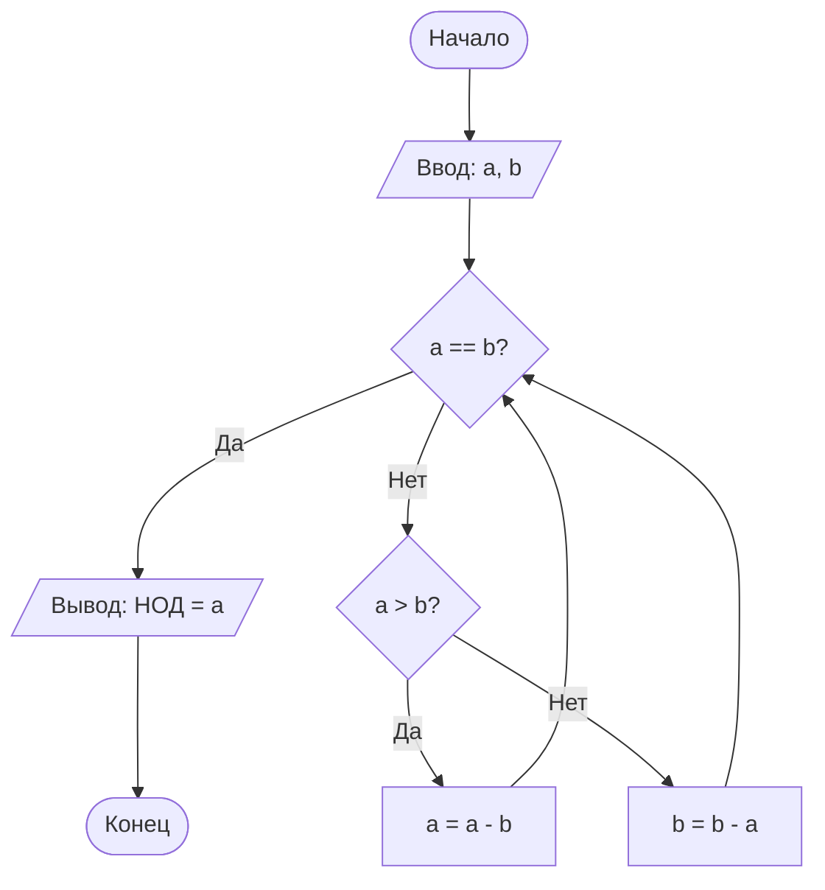

# Блок-схема алгоритма: Алгоритм Евклида для нахождения НОД

**Описание алгоритма:**  
Алгоритм Евклида находит наибольший общий делитель (НОД) двух целых неотрицательных чисел. Принцип работы: большее число заменяется на разность большего и меньшего (или остаток от деления), и процесс повторяется, пока числа не станут равными.

Входные данные: два целых числа `a` и `b`.

Выходные данные: НОД чисел `a` и `b`.

**Сложность:** O(log min(a, b))

---

## Диаграмма



---

    ## Пояснение шагов алгоритма Евклида

1. **Начало** — запуск алгоритма.

2. **Ввод данных** — пользователь вводит два целых числа `a` и `b`.

3. **Проверка равенства** — сравниваются `a` и `b`:
   - Если `a == b` → переход к шагу 4.
   - Если `a != b` → переход к шагу 5.

4. **Вывод результата** — на экран выводится значение `a` (которое равно `b`). Переход к шагу 8.

5. **Проверка большего числа** — определяется, какое число больше:
   - Если `a > b` → переход к шагу 6.
   - Если `b > a` → переход к шагу 7.

6. **Вычитание (a > b)** — выполняется операция `a = a - b`. Возврат к шагу 3.

7. **Вычитание (b > a)** — выполняется операция `b = b - a`. Возврат к шагу 3.

8. **Конец** — завершение работы алгоритма.

---

## Контрольные вопросы

**1. Что такое Mermaid и для чего он используется?**

Mermaid – это язык разметки для создания диаграмм и схем непосредственно в текстовом виде. Он используется для встраивания диаграмм в Markdown-документы без использования внешних графических редакторов.

**2. Как вставить диаграмму в Markdown-документ?**

Диаграмма вставляется с помощью блока кода с указанием языка `mermaid`:

```markdown
\```mermaid
flowchart TD
    Start --> Stop
\```
```

**3. Какие типы узлов (фигур) доступны в блок-схемах Mermaid?**

| Форма | Синтаксис | Назначение |
|-------|-----------|-------------|
| Прямоугольник | `id[Текст]` | Процесс |
| Скругленный | `id(Текст)` | Процесс |
| Ромб | `id{Текст}` | Условие |
| Овал | `id([Текст])` | Начало/конец |
| Параллелограмм | `id[/Текст/]` | Ввод/вывод |

**4. Чем отличаются стрелки `-->` и `-- текст -->`?**

- `-->` – простая стрелка без подписи
- `-- текст -->` – стрелка с текстовой подписью (используется для обозначения условий "Да"/"Нет")

**5. Как изменить ориентацию диаграммы с вертикальной на горизонтальную?**

Изменить направление графа:
- `TD` (Top-Down) – сверху вниз (вертикальная)
- `LR` (Left-Right) – слева направо (горизонтальная)

**6. Зачем нужны подграфы (subgraph)?**

Подграфы позволяют группировать связанные узлы для логического структурирования сложных диаграмм.

**7. Какие символы нельзя использовать в идентификаторах узлов?**

В идентификаторах узлов нельзя использовать: пробелы, знаки препинания, кавычки, скобки, специальные символы.

**8. Почему важно указывать начальный и конечный узлы?**

Начальный и конечный узлы явно обозначают границы алгоритма, делая блок-схему полной и понятной для чтения.